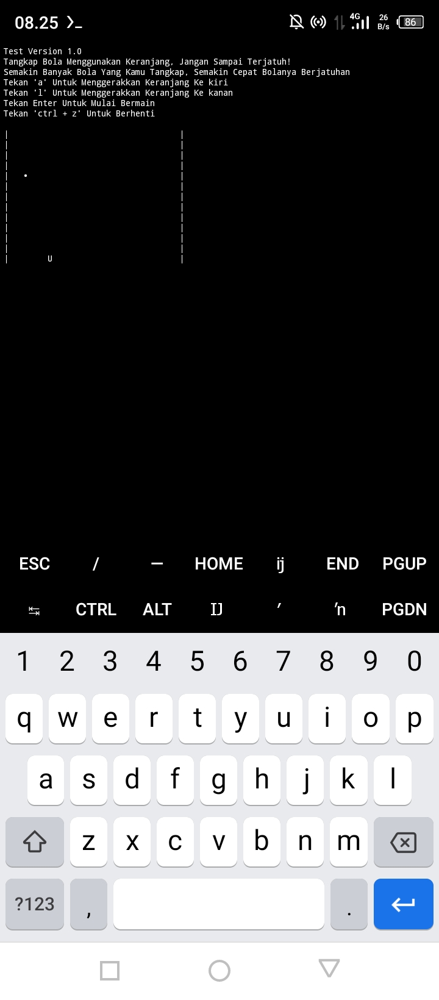

## Fan-game - Game Sederhana
Author: [Sptty Chan](https://www.facebook.com/profile.php?id=100024425583446)

#### Deskripsi
_Fan-game_ adalah game menangkap bola menggunakan keranjang. Game ini dibuat menggunakan library [_Fantable_](https://pypi.org/project/fantable/) dari saya. Gameplay sederhana & tingkat kesulitan yang terus bertambah jika anda bisa menangkap lebih banyak bola membuat game ini cukup asik untuk dimainkan.
#### Kompatibilitas
Untuk versi sekarang hanya support python versi 3.10. Uji coba dilakukan menggunakan termux dan berjalan lancar.
#### Cara Bermain
Cara memainkan game ini juga sangat mudah, anda cukup menggerakkan keranjang kearah kiri & kanan untuk menangkap bola yang jatuh. Gunakan tombol ***a*** pada keyboard untuk menggerakkan keranjang kearah kiri & gunakan tombol ***l*** pada keyboard untuk menggerakkan keranjang kearah kanan.
#### Cara Install
    $ pkg upgrade && pkg update
    $ pkg install Python3.10
    $ pkg install git
    $ pip install --upgrade fantable
    $ pip install cython
    $ pip install futures
    $ git clone https://github.com/sptty-chan/Fan-game
    $ cd Fan-game
    $ chmod 777 game
    $ ./game
    
